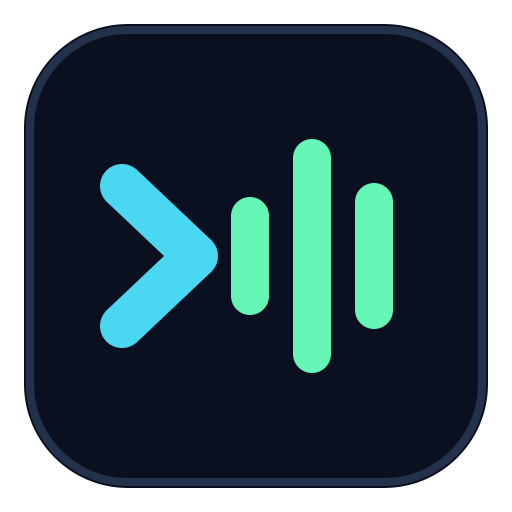

<p align="center">
  
</p>

<h1 align="center">MTUI</h1>

<p align="center">
  <strong>YouTube Music in the terminal, without turning your terminal into a browser.</strong>
</p>

<p align="center">
  A keyboard-driven Rust music player built for responsive navigation, bounded memory use, and long listening sessions.
</p>

<p align="center">
  <a href="https://github.com/lightzgls/mtui/actions/workflows/ci.yml"></a>
  <a href="https://github.com/lightzgls/mtui/releases/latest"></a>
  <a href="LICENSE"></a>
  
</p>

<!-- README_DEMO: Replace this paragraph with the GitHub video attachment URL on its own line. -->
<p align="center">
  <strong>Demo video coming soon.</strong><br>
  <sub>Search, artist pages, colored ASCII covers, and Now Playing.</sub>
</p>

> [!NOTE]
> MTUI is a personal, unofficial project built in public. It is not affiliated with or endorsed by YouTube, Google, or Discord. Ideas, bug reports, documentation improvements, and pull requests are welcome.

## At A Glance

| Discover | Listen | Make It Yours |
|---|---|---|
| Personalized Home shelves | Continuous queues and prefetching | Pixel or colored ASCII covers |
| Dedicated artist pages | Synced lyrics and comments | Four original app icon themes |
| Albums, playlists, and recommendations | Related music and queue expansion | Discord Rich Presence |
| Search by title, URL, or video ID | Liked songs and playlist editing | Windows notification-area controls |

```text
Home / Search / Library
          |
          v
 Artist -> Album / Playlist -> Track
                               |
                               v
                    Queue / Lyrics / Related / Comments
```

Search and playback work without an account. Personalized Home and Google Library access are optional and use separate sign-ins.

Discord Rich Presence is off by default. MTUI publishes playback details only after you enable it with `D` or in Settings.

## Quick Start

### Windows

Download `mtui.exe` from the [latest release](https://github.com/lightzgls/mtui/releases/latest), then run:

```powershell
.\mtui.exe
```

The executable is self-contained. Personalized Home sign-in uses the Microsoft Edge WebView2 runtime included with current Windows installations.

### Linux

Install Rust and the native audio and TLS development packages.

Debian or Ubuntu:

```sh
sudo apt install build-essential pkg-config libssl-dev libasound2-dev
```

Fedora:

```sh
sudo dnf install gcc pkgconf-pkg-config openssl-devel alsa-lib-devel
```

Build and install MTUI:

```sh
git clone https://github.com/lightzgls/mtui.git
cd mtui
cargo build --release
install -Dm755 target/release/mtui ~/.local/bin/mtui
mtui
```

Ensure `~/.local/bin` is on `PATH`.

## First Run

MTUI finds `yt-dlp` on `PATH` or downloads a private copy on first run. If `yt-dlp` cannot find a supported JavaScript runtime, MTUI reuses Deno, Node.js, or Bun from `PATH`, or installs Deno privately. Neither automatic install requires administrator access.

| Experience | Account needed | How to connect |
|---|---:|---|
| Search and playback | No | Start typing with `/` or `i` |
| Personalized Home | Optional | Press `M` on Windows |
| Liked songs and playlists | Optional | Configure Google OAuth, then press `A` |

## Sign In

### Personalized Home

On Windows, press `M` and complete sign-in in MTUI's YouTube Music window. MTUI opens the real `music.youtube.com` page, never receives form values or passwords, and stores only the resulting YouTube session cookies in its private configuration directory.

MTUI prompts for this session automatically when Home has no usable session. OAuth tokens cannot authenticate YouTube Music's private Home feed.

The embedded Home sign-in is currently Windows-only. A session can instead be supplied manually by placing the complete `Cookie` request header from a signed-in `music.youtube.com` request in `cookies.txt` inside the configuration directory. Treat this file like a password.

### Google Library

Press `A` to connect liked songs, playlists, and playlist editing through the YouTube Data API. This requires your own Google OAuth client:

1. Create a project in the [Google Cloud Console](https://console.cloud.google.com/) and enable **YouTube Data API v3**.
2. Configure the OAuth consent screen and add your account as a user. Publishing the app avoids Google's seven-day token expiry for apps left in testing.
3. Create an OAuth client with application type **TV and Limited Input devices**.
4. Create `client.json` in MTUI's configuration directory:

```json
{
  "client_id": "your-client-id",
  "client_secret": "your-client-secret"
}
```

Press `A` again and follow the device-code prompt. MTUI stores refreshed tokens locally and does not bundle a shared Google client.

## Controls

`Ctrl-K` opens the global App Menu. Outside search entry, `.` opens actions for the current page or selection.

| Key | Action |
|---|---|
| `Ctrl-K` | Open the App Menu for navigation, accounts, settings, help, tray, and quit |
| `.` | Open page and selection actions, including available artist links |
| `?` | Open keyboard help |
| Arrows or `hjkl` | Move through rows, cards, shelves, and tabs |
| `g` / `G` | Jump to the beginning or end |
| `Page Up` / `Page Down` | Move by a page |
| `Enter` | Play or open the selected item |
| `/` or `i` | Search |
| `Esc` or `H` | Back or Home |
| `P` | Open the player |
| `L` or `Ctrl-L` | Open the library |
| `Space` | Pause or resume |
| `+` / `-` | Change volume |
| Left / Right | Seek five seconds while browsing tracks or the player |
| `n` / `p` | Next or previous track on the player |
| `1`-`4` or `Tab` | Open Queue, Lyrics, Related, or Comments |
| `a` | Add the selected track to a playlist |
| `f` | Like or unlike the selected track |
| `c` | Change cover-art size |
| `A` | Start Google Library sign-in |
| `M` | Start personalized Home sign-in |
| `D` | Toggle Discord Rich Presence directly |
| `S` or `Ctrl-S` | Open settings for tray, song cover, app icon, and Discord presence |
| `B` | Continue in the Windows notification area |
| `q` or `Ctrl-C` | Quit |

## Windows Tray

Press `B` while music is playing to close the terminal and continue in the notification area. Closing the terminal with its `X` button also moves MTUI to the tray without interrupting playback. The tray menu can show MTUI, pause or resume, move between tracks, and quit.

Enable **Keep notification-area icon** under Settings to retain the icon while the terminal UI is open. Windows may place new icons under the hidden-icons `^` menu.

## Configuration

| Platform | Configuration directory |
|---|---|
| Windows | `%APPDATA%\mtui` |
| Linux | `$XDG_CONFIG_HOME/mtui`, or `~/.config/mtui` |

Downloaded tools are kept separately under `%LOCALAPPDATA%\mtui` on Windows or `$XDG_CACHE_HOME/mtui` on Linux.

MTUI detects sixel support automatically. Set `MTUI_GRAPHICS=blocks` to force terminal-cell rendering or `MTUI_GRAPHICS=sixel` to force sixel output. The Settings panel switches song covers between pixel art and colored ASCII.

### Diagnostics

MTUI records startup, shutdown, crashes, and subsystem failures in `mtui.log` inside the configuration directory. The log rotates at 1 MiB and keeps one backup as `mtui.log.1`. URLs and credential-bearing messages are redacted; cookies, tokens, and song titles are not intentionally logged.

## Contributing

MTUI is a personal project, not a company-backed product, and contributions are genuinely useful.

- Found a bug or rough edge? [Open an issue](https://github.com/lightzgls/mtui/issues/new).
- Have an improvement? [Start a pull request](https://github.com/lightzgls/mtui/compare).
- Unsure whether an idea fits? Open an issue first and describe the user problem.

Please keep changes focused, explain behavior changes, and add tests when the affected code has a practical test seam.

### Development

MTUI uses Rust 2024 and requires Rust 1.85 or newer.

```sh
cargo test --workspace --all-targets
cargo clippy --workspace --all-targets -- -D warnings
```

Network and live-account tests are ignored by default.

Windows releases use the MSVC target so WebView2's loader is linked into `mtui.exe`. GNU Windows builds remain supported, but require the generated `WebView2Loader.dll` beside the executable.

## License

Released under the [MIT License](LICENSE).
