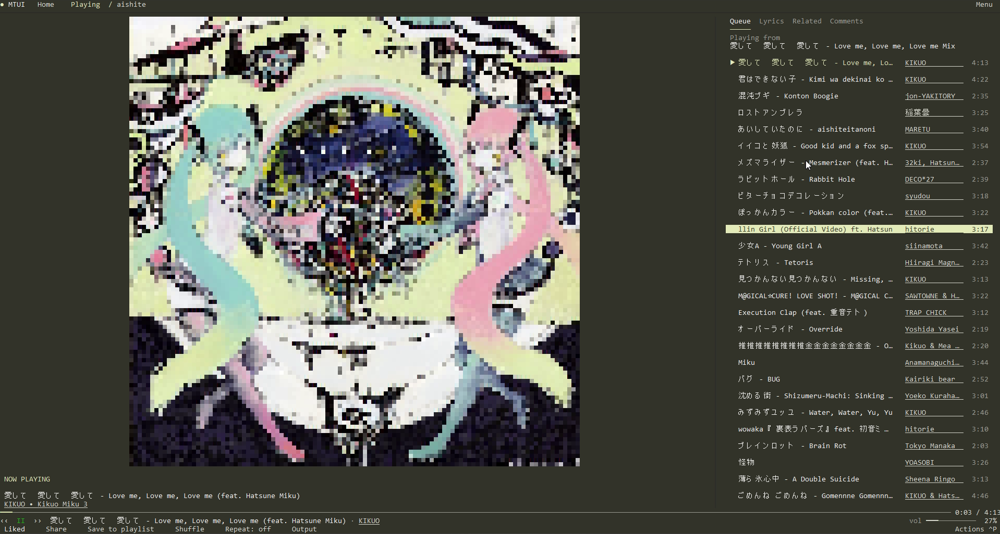
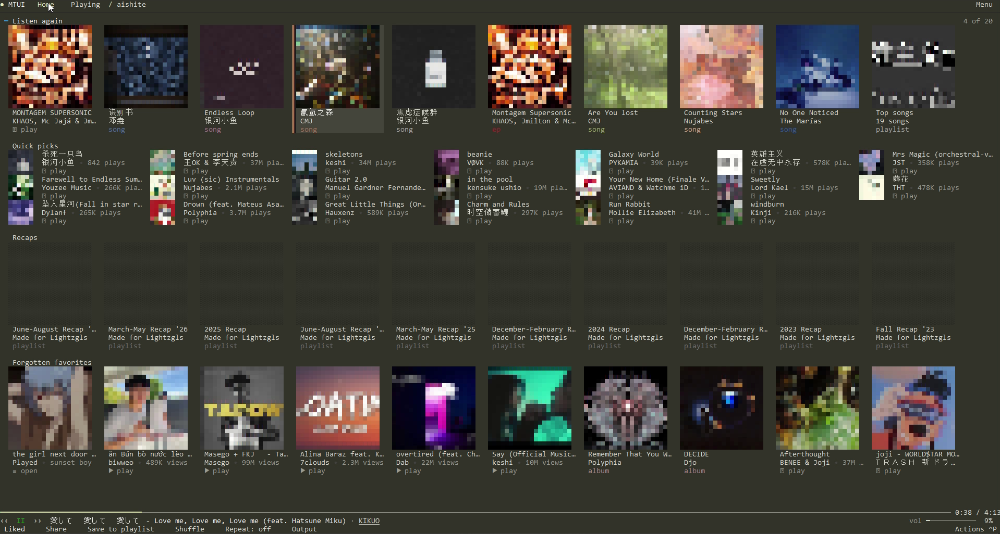
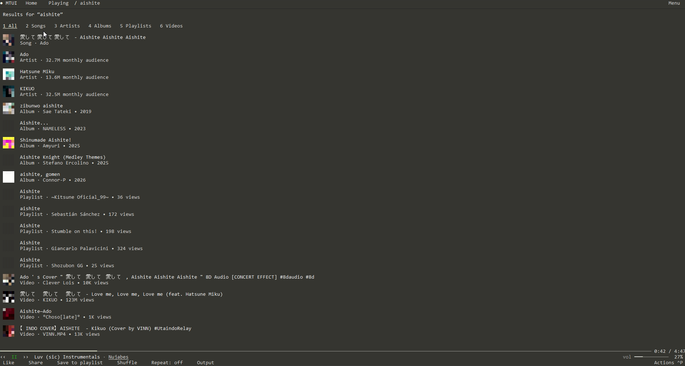
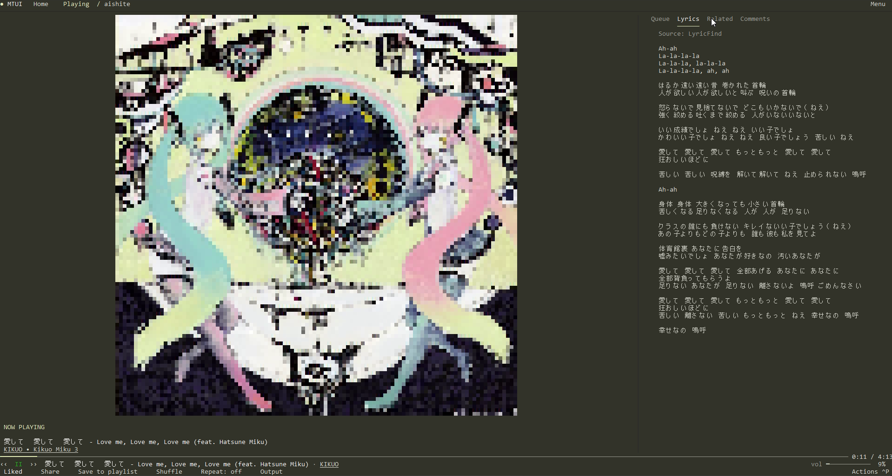
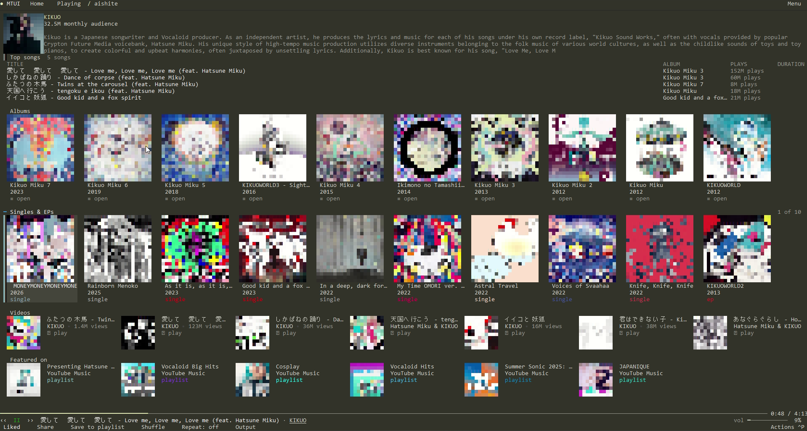
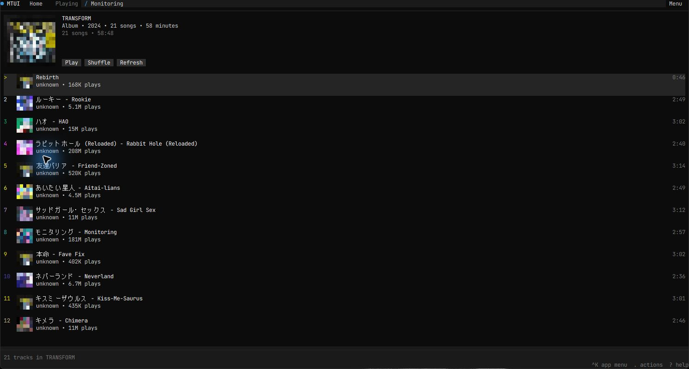
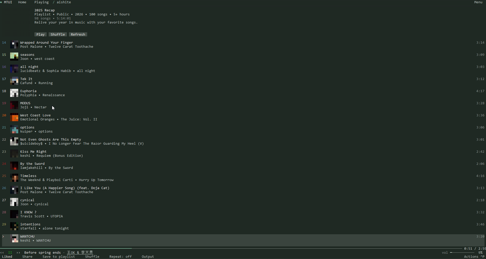
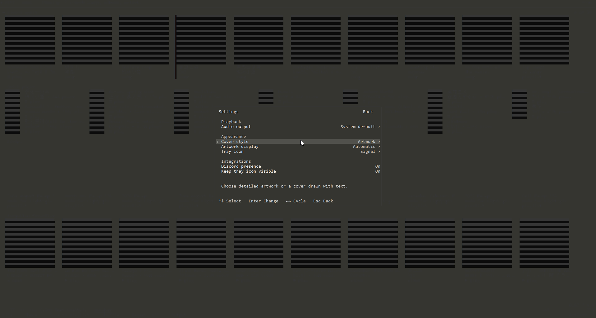
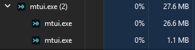

# MTUI

A lightweight YouTube Music player with a mouse-friendly terminal interface and native audio playback. Built with Rust, primarily for Windows.

[Download](https://github.com/lightzgls/mtui/releases/latest) · [Report an issue](https://github.com/lightzgls/mtui/issues) · [Usage guide](docs/usage.md)

## Preview

[](https://github.com/lightzgls/mtui/raw/refs/heads/main/assets/previews/overview.mp4)

**[Watch the overview video](https://github.com/lightzgls/mtui/raw/refs/heads/main/assets/previews/overview.mp4)** — a real screen recording of the app.

<details>
<summary>More screenshots</summary>

**Personalized Home**



**Search**



**Lyrics**



**Artist**



**Album**



**Playlist**



**Settings**



</details>

## Features

- Search songs, artists, albums, playlists, and videos; browse personalized Home and saved playlists.
- Native AAC playback, queue management, seeking, shuffle, repeat, and audio output selection.
- Like songs, share links, save to playlists, and sync listening history with your signed-in account.
- Lyrics, including synced lyrics when available, plus comments and related music.
- Solid colors drawn from the cover, pixel or ASCII artwork, and keyboard and mouse navigation.
- Optional Discord Rich Presence and Windows tray controls. Reopening MTUI restores the running session.

## Install

Download **MTUI-<version>-Setup-x64.exe** from the [latest release](https://github.com/lightzgls/mtui/releases/latest). The Windows installer requires no administrator permission. A single portable executable is also available.

On first launch, MTUI downloads missing playback tools: yt-dlp, a supported JavaScript runtime, and the bgutil PO-token provider. Setup needs an internet connection. Sign-in uses Microsoft Edge WebView2; playback runs without a browser window.

Search and playback work without an account. Press **M** or open **Menu → Account & Sessions** to sign in for personalized Home, playlists, likes, and listening-history sync. YouTube account history must be enabled for history writes.

Settings and sessions live in `%APPDATA%\mtui`; downloaded tools live in `%LOCALAPPDATA%\mtui`. Upgrades preserve your data. See the [usage guide](docs/usage.md) for setup, troubleshooting, and Linux/macOS instructions.

## Controls

| Key | Action |
|---|---|
| `/` | Search |
| Arrows / `hjkl`, `Enter` | Navigate and open or play |
| `Space`, `n` / `p` | Pause/resume, next/previous track |
| `+` / `-`, `m` | Volume, mute |
| `Tab` / `1`–`4` | Queue, Lyrics, Related, Comments |
| `Ctrl-K`, `Ctrl-P` | App menu, playback actions |
| `S`, `?` | Settings, full keyboard help |
| `Esc`, `q` | Back, quit |

Click cards, links, tabs, and player controls; drag the progress bar to seek. Closing the Windows window continues playback in the tray. Use **Menu → Quit** or the tray's Quit command to exit fully.

## Resource use



User-provided Task Manager snapshot: **27.6 MB total across two MTUI processes**, with **0% CPU at capture**. Usage varies with playback, artwork, sign-in, and helper tools; this is one snapshot, not a long-session benchmark.

## Development

Use current stable Rust and the Windows MSVC toolchain for a single-file executable.

```sh
cargo build --release --locked
cargo test --workspace --all-targets --locked
cargo clippy --workspace --all-targets --locked -- -D warnings
```

Windows output: `target/release/mtui.exe`. Live network/account tests are ignored by default. See [requirements](docs/requirements.md), [analysis](docs/analysis.md), and [design](docs/design.md) for scope and architecture. Focused pull requests and bug reports are welcome.

## Acknowledgments and references

[Pear Desktop](https://github.com/pear-devs/pear-desktop) was the main inspiration for MTUI's listening experience. Thank you to the Pear Desktop team, and to the maintainers and contributors whose work supports this project:

- [YouTube Music](https://music.youtube.com/) and [Spotify](https://open.spotify.com/) — references for browsing, navigation, and player layout.
- [ytmusicapi](https://github.com/sigma67/ytmusicapi) and [YouTube.js](https://github.com/LuanRT/YouTube.js) — implementation references for YouTube Music requests, account actions, and playlist parsing.
- [Lavalink YouTube Source](https://github.com/lavalink-devs/youtube-source) — a reference for playback reliability research.
- [yt-dlp](https://github.com/yt-dlp/yt-dlp) and [bgutil-ytdlp-pot-provider](https://github.com/Brainicism/bgutil-ytdlp-pot-provider) — stream extraction fallback and PO-token support.
- [LRCLIB](https://lrclib.net/) — community lyrics and synchronized timing fallback.
- [Ratatui](https://ratatui.rs/) and [Crossterm](https://github.com/crossterm-rs/crossterm) — the terminal interface; [Rodio](https://github.com/RustAudio/rodio) and [Symphonia](https://github.com/pdeljanov/Symphonia) — native audio playback and decoding.
- [Tokio](https://tokio.rs/), [Reqwest](https://github.com/seanmonstar/reqwest), [wry](https://github.com/tauri-apps/wry), and [tao](https://github.com/tauri-apps/tao) — background work, networking, and native sign-in.
- [Best-README-Template](https://github.com/othneildrew/Best-README-Template) — the initial documentation structure.

## License

[MIT](LICENSE). External playback tools have their own licenses, including the GPL-3.0 bgutil provider. MTUI is an unofficial personal project, unaffiliated with YouTube, Google, or Discord.
