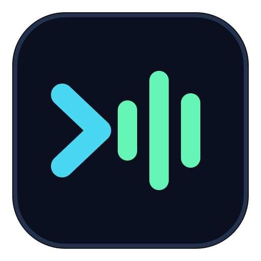

<a id="readme-top"></a>

<!--
*** MTUI README — structured after othneildrew/Best-README-Template.
*** Reference-style links are collected at the bottom of this file.
-->

<!-- PROJECT LOGO -->
<br />
<div align="center">
  <a href="https://github.com/lightzgls/mtui">
    
  </a>

  <h3 align="center">MTUI</h3>

  <p align="center">
    A small, native YouTube Music player for your terminal.
    <br />
    Fast navigation, native audio playback, bounded caches, and an optional
    browser window used only while signing in.
    <br />
    <br />
    <a href="https://github.com/lightzgls/mtui/releases/latest">Download</a>
    &middot;
    <a href="https://github.com/lightzgls/mtui/issues/new?labels=bug">Report Bug</a>
    &middot;
    <a href="https://github.com/lightzgls/mtui/issues/new?labels=enhancement">Request Feature</a>
  </p>
</div>

## Preview


> [!NOTE]
> MTUI is a personal, unofficial project built in public. It is not affiliated
> with or endorsed by YouTube, Google, or Discord. Ideas, bug reports,
> documentation improvements, and pull requests are welcome.

<!-- TABLE OF CONTENTS -->
<details>
  <summary>Table of Contents</summary>
  <ol>
    <li><a href="#preview">Preview</a></li>
    <li>
      <a href="#about-the-project">About The Project</a>
      <ul>
        <li><a href="#highlights">Highlights</a></li>
        <li><a href="#built-with">Built With</a></li>
      </ul>
    </li>
    <li>
      <a href="#getting-started">Getting Started</a>
      <ul>
        <li><a href="#prerequisites">Prerequisites</a></li>
        <li><a href="#installation">Installation</a></li>
      </ul>
    </li>
    <li>
      <a href="#usage">Usage</a>
      <ul>
        <li><a href="#first-run">First Run</a></li>
        <li><a href="#sign-in">Sign In</a></li>
        <li><a href="#controls">Controls</a></li>
        <li><a href="#windows-tray">Windows Tray</a></li>
        <li><a href="#configuration">Configuration</a></li>
      </ul>
    </li>
    <li><a href="#roadmap">Roadmap</a></li>
    <li><a href="#contributing">Contributing</a></li>
    <li><a href="#license">License</a></li>
    <li><a href="#contact">Contact</a></li>
    <li><a href="#acknowledgments">Acknowledgments</a></li>
  </ol>
</details>

<!-- ABOUT THE PROJECT -->
## About The Project

MTUI is a terminal music player for YouTube Music, built to stay small in memory.
It offers fast navigation, native AAC playback, bounded caches, colored ASCII or
image covers, and an optional native browser window that is used only while you
sign in.

Search and playback work without an account. Signing in adds your personalized
YouTube Music Home, saved playlists, Like state, playlist saves, and listening
history synchronization. Search includes songs, artists, albums, playlists, and
videos, with filters for each result type.

Discord Rich Presence is off by default. MTUI publishes playback details only
after you enable it with `D` or in Settings.

### Highlights

These features describe the current development build.

| Browse | Play | Personalize |
|---|---|---|
| Mixed search with song, artist, album, playlist, and video filters | Native AAC playback with bounded buffering and URL recovery | Solid app colors derived from the current cover |
| Personalized Home shelves and saved playlist pages | Continuous queues, prefetching, seeking, shuffle, and repeat | Kitty images, pixel art, or colored ASCII |
| Clickable artist and album links, synced lyrics, comments, and related music | Like, Share, Save to playlist, and output-device controls | Discord Rich Presence, four icon themes, and Windows tray controls |

```text
Home / Search
          |
          v
 Artist -> Album / Playlist -> Track
                               |
                               v
                    Queue / Lyrics / Related / Comments
```

### Built With

- [Rust][rust-url] (2024 edition)
- [ratatui][ratatui-url] and [crossterm][crossterm-url] for the terminal UI
- [Tokio][tokio-url] for the streaming runtime
- [rodio][rodio-url] for native AAC playback
- [reqwest][reqwest-url] for HTTP
- [wry / tao][wry-url] for the sign-in window

<p align="right">(<a href="#readme-top">back to top</a>)</p>

<!-- GETTING STARTED -->
## Getting Started

### Prerequisites

**Windows** — nothing to install. The executable is self-contained, and
personalized Home sign-in uses the Microsoft Edge WebView2 runtime included with
current Windows installations.

**Linux** — install Rust and the native audio, TLS, and WebKitGTK development
packages.

Debian or Ubuntu:

```sh
sudo apt install build-essential pkg-config libssl-dev libasound2-dev libwebkit2gtk-4.1-dev
```

Fedora:

```sh
sudo dnf install gcc pkgconf-pkg-config openssl-devel alsa-lib-devel webkit2gtk4.1-devel
```

Arch Linux:

```sh
sudo pacman -S --needed base-devel pkgconf openssl alsa-lib webkit2gtk-4.1
```

**macOS** — install the Xcode command-line tools and Rust. WKWebView is provided
by macOS.

### Installation

**Windows** — download and run `MTUI-<version>-Setup-x64.exe` from the
[latest release](https://github.com/lightzgls/mtui/releases/latest). The
per-user installer needs no administrator permission. It gives MTUI a stable
home under `%LOCALAPPDATA%\Programs\MTUI`, adds Start-menu and uninstall
entries, and offers an optional desktop shortcut.

Upgrading or uninstalling the program does not erase account sessions,
preferences, or listening history in `%APPDATA%\mtui`. An existing portable
copy uses that same data automatically. A standalone portable executable is
still attached to each release for users who explicitly want one.

**Linux and macOS** — clone the repository, then build and install MTUI with one
Cargo command:

```sh
git clone https://github.com/lightzgls/mtui.git
cd mtui
cargo install --path . --bins --root ~/.local --locked --force
mtui
```

Cargo installs the player and its private sign-in helper together. You never need
to launch or install the helper separately. Ensure `~/.local/bin` is on `PATH`.

On first run, MTUI finds `yt-dlp` on `PATH` or downloads a private copy. If
`yt-dlp` cannot find a supported JavaScript runtime, MTUI reuses Deno, Node.js, or
Bun from `PATH`, or installs Deno privately. MTUI also installs a pinned local
copy of the GPL-3.0 `bgutil-ytdlp-pot-provider` and its production dependencies so
YouTube's protected audio streams can play at normal quality. These automatic
installs require network access but not administrator access.

<p align="right">(<a href="#readme-top">back to top</a>)</p>

<!-- USAGE -->
## Usage

The top bar provides Home, Playing, search, and Menu. Home uses artwork shelves;
Now Playing shows artwork beside Queue, Lyrics, Related, and Comments. In a
narrow window the track header moves above the tabs. Progress and playback
controls stay at the bottom on every page. The cover supplies a muted solid
background, matching surfaces, and an accent throughout the app.

Queue entries have space between songs and clear title, artist, and duration
columns. Short windows use compact rows. Click the current artist or album to
open its page when YouTube Music provides that link; queue artists are clickable
when the artist column is visible.

The playback bar offers **Like, Share, Save to playlist, Shuffle, Repeat, and
Output**. Smaller windows keep the full set in **Actions**, also available with
`Ctrl-P` outside search entry. Share shows the song's YouTube Music link; the
Windows build also provides a Copy link button.
Like and playlist saves use the signed-in account and show pending, confirmed,
or failed states. The playlist picker marks songs already saved and keeps the
song it was opened for even if playback moves to another track.

`Ctrl-K` shows a compact menu grouped into navigation, app preferences, and
window actions. Its displayed shortcuts work while the menu is open. Settings
groups audio output under Playback, cover and icon choices under Appearance,
and Discord/tray switches under Integrations. Click a value or press Enter to
choose it; a choice list changes nothing until you confirm. Esc cancels the
choice list, then returns to Settings and the menu it was opened from.

`Ctrl-K` opens the global App Menu. Outside search entry, `.` opens actions for
the current page or selection. The terminal UI also accepts the mouse: use the
wheel to navigate, click the search box to edit, and click visible cards, rows,
player tabs, or queue entries to open them. Click or drag the progress bar to
seek; the persistent player also exposes previous, play/pause, next, and volume
controls wherever the terminal is wide enough to show them clearly. Press `m`
or click the `vol`/`mut` label to mute or restore the previous volume. Right-click
an item to select it and open its actions; every menu row is clickable. If a
track cannot play, press `r` to retry it or `n` to skip to the next queue item.

### First Run

| Experience | Account needed | How to connect |
|---|---:|---|
| Search and playback | No | Start typing with `/` or `i` |
| Personalized Home and saved playlists | Yes | Press `M` or use App Menu → Account & Sessions |
| Likes, saving songs to playlists, and listening-history sync | Yes | Use the same YouTube Music session |
| Share links, shuffle, repeat, and output-device selection | No | Use the playback bar or `Ctrl-P` |

### Sign In

Press `M`. MTUI opens `music.youtube.com` in a temporary native sign-in window.
Complete Google's flow and the window closes as soon as the session is ready.
MTUI stores the resulting YouTube session cookies in its private configuration
directory; it does not receive the password entered into the page.

On Linux and macOS, the WebKit sign-in code lives in the small `mtui-sign-in`
companion installed automatically with MTUI. It runs only during sign-in and
exits immediately afterward, keeping the long-running player free of the browser
runtime. Windows keeps the same behavior inside its single published executable.

When YouTube rejects the saved cookie snapshot, MTUI first opens its persistent
browser profile out of sight and lets YouTube renew the session. The window is
shown only if Google actually needs attention. A complete `Cookie`
request-header value may still be placed manually in `cookies.txt` as a
compatibility fallback. Treat that file like a password.

To log out, open **App Menu → Account & Sessions → Log out of YouTube Music**.
MTUI removes its saved session, the manual-cookie fallback, and its private
sign-in profile without stopping current playback.

### Controls

| Key | Action |
|---|---|
| `Ctrl-K` | Open the App Menu for navigation, accounts, settings, help, tray, and quit |
| `.` | Open page and selection actions, including available artist links |
| `Ctrl-P` | Open all six playback actions outside search entry |
| `?` | Open keyboard help |
| Arrows or `hjkl` | Move through rows, cards, shelves, and tabs |
| `g` / `G` | Jump to the beginning or end |
| `Page Up` / `Page Down` | Move by a page |
| `Enter` | Play or open the selected item |
| `/` or `i` | Search |
| `Esc` or `H` | Back or Home |
| `P` | Open the player |
| `Space` | Pause or resume |
| `+` / `-` | Change volume |
| `m` | Mute or restore the previous volume |
| Left / Right | Seek five seconds while browsing tracks or the player |
| `n` / `p` | Next or previous track on the player |
| `r` | Retry the current track on the player, or refresh the current browse page |
| `R` | Cycle repeat off, all, or one |
| `d` | Remove the selected upcoming queue track |
| `K` / `J` | Move the selected upcoming queue track |
| `z` / `C` | Shuffle or clear upcoming tracks |
| `1`-`4` or `Tab` | Open Queue, Lyrics, Related, or Comments |
| `c` | Change cover-art size |
| `M` | Import or refresh the personalized Home session |
| `D` | Toggle Discord Rich Presence directly |
| `S` or `Ctrl-S` | Open grouped settings; Enter chooses a value, Left/Right cycles choices |
| `B` | Continue in the Windows notification area |
| `q` or `Ctrl-C` | Quit |

### Windows Tray

Press `B` while music is playing to close the terminal and continue in the
notification area. Closing the terminal with its `X` button also moves MTUI to the
tray without interrupting playback. The tray menu can show MTUI, pause or resume,
move between tracks, and quit.

Opening the executable or its shortcut again restores the running session.
Use **App Menu → Quit**, the tray's Quit command, or `Ctrl-C` to exit fully
before opening an updated build.

Enable **Keep tray icon visible** under Settings → Integrations to retain the icon while the
terminal UI is open. Windows may place new icons under the hidden-icons `^` menu.

### Configuration

| Platform | Configuration directory |
|---|---|
| Windows | `%APPDATA%\mtui` |
| Linux | `$XDG_CONFIG_HOME/mtui`, or `~/.config/mtui` |

Downloaded tools are kept separately under `%LOCALAPPDATA%\mtui` on Windows or
`$XDG_CACHE_HOME/mtui` on Linux.

**Resource use.** Playback uses a fixed 1 MiB audio ring buffer and a fixed
2 MiB packet cache for MP4 interleaving rather than downloading a whole song
into memory. MTUI holds one current cover, and its
Home/artist artwork LRU is capped at 32 images with a raw RGB budget of about
6 MiB. Late image replies for evicted cards are discarded. Process monitors may
report additional shared audio, TLS, and system-library pages as resident memory,
but caches do not grow with the number of songs played. Around 50 MiB during
steady playback remains the design target and needs verification across playback
and sign-in scenarios.

**Playback recovery.** Complete audio-only AAC streams are preferred before the
combined video/audio fallback. Only AAC packets reach the audio decoder, and
duration comes from the audio track. A replacement keeps the current listening
position; byte ranges are spliced only when format, file size, and revision
match. Automatic recovery and manual Retry both bypass failed cached URLs.
An opening HTTP 403 triggers one fresh-URL recovery before an error is shown.

**Graphics.** MTUI detects Kitty graphics and Sixel support automatically. The
Settings panel's **Artwork display** choice can keep automatic detection, force
Kitty (useful when a multiplexer hides terminal capabilities), or use universal
terminal-cell pixel art. **Cover style** separately switches the large current-song
cover between bitmap/pixel rendering and colored ASCII. Artwork is center-cropped
to a square sleeve. `MTUI_GRAPHICS=blocks`, `MTUI_GRAPHICS=kitty`, and
`MTUI_GRAPHICS=sixel` remain available as startup overrides for automatic
detection. MTUI's native Windows window locks font zoom and recalculates artwork
geometry when resized or moved between monitors with different scaling.

**Diagnostics.** MTUI records startup, shutdown, crashes, and subsystem failures
in `mtui.log` inside the configuration directory. The log rotates at 1 MiB and
keeps one backup as `mtui.log.1`. URLs and credential-bearing messages are
redacted; cookies, tokens, and song titles are not intentionally logged.

**Listening history.** With YouTube Music signed in, MTUI reports a song after
30 seconds of actual playback. The local journal records the full listening
duration when you skip, finish, or quit. Pauses, buffering, and seek jumps do not
count as listening. Reports are persisted before network delivery, retried every 30
seconds while open and on the next launch, and acknowledged only after the song
appears in recent YouTube Music history. A successful telemetry HTTP response
alone does not discard the pending report. YouTube account history must be
enabled for writes to appear; logging out clears that account's pending reports.
On upgrade, unverified reports from the previous 24 hours are checked and recovered.

<p align="right">(<a href="#readme-top">back to top</a>)</p>

<!-- ROADMAP -->
## Roadmap

- [x] Native AAC playback with bounded buffering
- [x] Personalized YouTube Music Home with optional sign-in
- [x] Mixed search filters and album, artist, and saved playlist pages
- [x] Like, Share, Save to playlist, Shuffle, Repeat, and Output in the player
- [x] Cover-derived app colors, spaced queue rows, and mouse navigation
- [x] Synced lyrics, comments, and related music
- [x] Discord Rich Presence and four icon themes
- [x] Windows notification-area controls
- [x] Unified YouTube Music sign-in on every desktop
- [x] Reopening the Windows shortcut restores the same running session
- [ ] Verify the steady-playback memory target across long sessions
- [ ] Demo video

See the [open issues](https://github.com/lightzgls/mtui/issues) for a full list of
proposed features and known issues. Unsure whether an idea fits? Open an issue
first and describe the user problem.

<p align="right">(<a href="#readme-top">back to top</a>)</p>

<!-- CONTRIBUTING -->
## Contributing

MTUI is a personal project. Contributions, bug reports, and documentation
improvements are welcome.

- Found a bug or rough edge? [Open an issue](https://github.com/lightzgls/mtui/issues/new).
- Have an improvement? [Start a pull request](https://github.com/lightzgls/mtui/compare).
- Unsure whether an idea fits? Open an issue first and describe the user problem.

The standard flow:

1. Fork the project
2. Create your feature branch (`git checkout -b feature/my-change`)
3. Commit your changes (`git commit -m 'Describe the change'`)
4. Push to the branch (`git push origin feature/my-change`)
5. Open a pull request

Please keep changes focused, explain behavior changes, and add tests when the
affected code has a practical test seam.

### Development

MTUI uses Rust 2024. Use the current stable toolchain; the locked ratatui version
requires Rust 1.88 or newer.

The main feature boundaries are:

- `src/app/`: navigation state, settings, and player-action behavior.
- `src/ui/`: page layouts, dialogs, artwork palette, queue spacing, and mouse targets.
- `src/source/`: YouTube Music reads, account writes, and background workers.
- `src/player/`: native audio playback, bounded buffering, and stream recovery.
- `crates/mtui-resolver/`: source resolution and fallback selection.

Build the unified Windows executable with:

```sh
cargo build --locked --release --bin mtui
```

The output is `target/release/mtui.exe`. The Windows sign-in helper is embedded in
that executable. Run the normal checks before committing:

```sh
cargo test --workspace --all-targets
cargo clippy --workspace --all-targets -- -D warnings
```

Network and live-account tests are ignored by default.

Windows releases use the MSVC target so WebView2's loader is linked into
`mtui.exe`. GNU Windows builds remain supported, but require the generated
`WebView2Loader.dll` beside the executable.

Tagged releases also compile `installer/mtui.iss` with Inno Setup. The older
`scripts/install-shortcut.ps1` remains a development convenience for pointing a
Start-menu shortcut at a local build; it is not the release installer.


<p align="right">(<a href="#readme-top">back to top</a>)</p>

<!-- LICENSE -->
## License

Distributed under the MIT License. See [`LICENSE`](LICENSE) for more information.

<p align="right">(<a href="#readme-top">back to top</a>)</p>

<!-- CONTACT -->
## Contact

Lightzgls — [@lightzgls](https://github.com/lightzgls)

Project Link: [https://github.com/lightzgls/mtui](https://github.com/lightzgls/mtui)

<p align="right">(<a href="#readme-top">back to top</a>)</p>

<!-- ACKNOWLEDGMENTS -->
## Acknowledgments

- [Best-README-Template](https://github.com/othneildrew/Best-README-Template)
- [yt-dlp](https://github.com/yt-dlp/yt-dlp)
- [bgutil-ytdlp-pot-provider](https://github.com/Brainicism/bgutil-ytdlp-pot-provider)
- [ratatui](https://ratatui.rs)
- [rodio](https://github.com/RustAudio/rodio)
- [contrib.rocks](https://contrib.rocks)

<p align="right">(<a href="#readme-top">back to top</a>)</p>

<!-- MARKDOWN LINKS & IMAGES -->
[rust-url]: https://www.rust-lang.org
[ratatui-url]: https://ratatui.rs
[crossterm-url]: https://github.com/crossterm-rs/crossterm
[tokio-url]: https://tokio.rs
[rodio-url]: https://github.com/RustAudio/rodio
[reqwest-url]: https://github.com/seanmonstar/reqwest
[wry-url]: https://github.com/tauri-apps/wry
