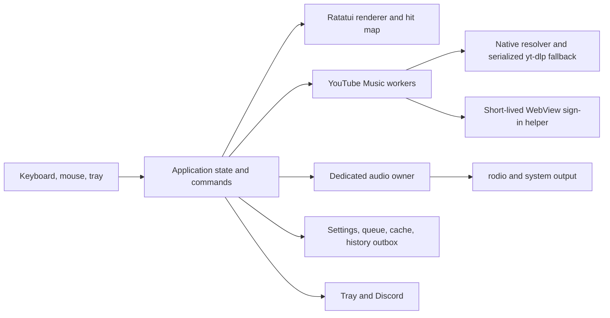

# MTUI System Analysis

**Status:** Active\
**Version:** 0.2\
**Date:** 2026-10-06\
**Related document:** [Product requirements](requirements.md)

## 1. Executive assessment

MTUI already has the correct technical base for the product: a Rust TUI,
native audio, bounded buffering, YouTube Music browsing, optional sign-in,
queue management, lyrics, comments, related music, artwork, Discord presence,
and tray controls. Replacing the interface with a GUI added a second product
surface before the first one was fully organized and feature-complete.

The TUI should remain the primary interface. Ratatui can render into a
deterministic in-memory backend, so layout, clipping, Unicode, focus, and state
changes can be tested immediately without manual screenshot comparison. It also
fits the 50 MiB goal better than a permanent browser or GPU-heavy UI stack.

The main problem is therefore not the terminal. It is the concentration of
state, input routing, and rendering in a few large files, plus gaps in playback
recovery, account/library behavior, and discoverability.

## 2. Current system



The concurrency choices are sound. The UI thread does not own the decoder,
source work happens away from rendering, and expensive fallback resolution is
serialized. These boundaries should be preserved.

## 3. Capability assessment

| Area | Current strength | Remaining work |
|---|---|---|
| Playback | Native AAC playback, seek, volume, bounded stream buffer, URL refresh | Better error classification, format fallback, compatibility tests, persistent recovery state |
| Home/search | Public and personalized Home, search, artists, albums, playlists | Richer result grouping, suggestions, continuations, clearer loading and partial states |
| Library/account | Session capture and personalized data | Coherent Library, likes, remote history, mutations, encrypted session storage, clearer repair flow |
| Queue | Continuation, reorder, remove, clear, shuffle, repeat, prefetch | Crash-safe persistence, consistent context actions, stronger mouse manipulation |
| Player content | Artwork, synchronized/plain lyrics, LRCLIB fallback, related music, comments | One dedicated Now Playing composition and complete state handling |
| Input | Strong keyboard controls plus mapped click and wheel targets | Full mouse parity, seek/volume click behavior, visible discoverability |
| Integrations | Tray and Discord Rich Presence | Windows media keys/metadata, optional notifications |
| Installation | Installer, portable binary, automatic runtime discovery | First-run progress and repair inside the normal TUI flow |
| Diagnostics | Redacted rotating log | Component-health view and copyable sanitized report |

## 4. Why the GUI attempt failed

The GUI prototype introduced a separate Slint component tree and a second set
of navigation models before the live product behavior was connected. It became
easy to produce attractive isolated screens and hard to prove that playback,
queue, sign-in, recovery, and every feature state worked together. Visual
iteration also depended on launching and inspecting a separate window.

That work increased dependency count, build time, and architectural surface
without improving the existing player. The resulting screens drifted from the
requirements because component creation led feature behavior.

The TUI reverses that relationship: each screen is rendered from real
application state, and its result can be inspected in tests as a cell buffer.

## 5. Structural analysis

`src/app.rs` and `src/ui.rs` carry too many responsibilities. The code works,
but feature work risks touching navigation, input, network coordination, and
layout at once.

The next refactor should be incremental:

1. Keep the existing executable and playback path working.
2. Introduce semantic commands for user intent.
3. Split page state and page rendering by feature.
4. Keep shared shell, player, overlays, and hit testing centralized.
5. Move source parsing and service coordination behind narrow interfaces.
6. Add tests before moving behavior, then delete the old path after parity.

Suggested boundaries:

```text
src/
  app/             lifecycle, command dispatch, navigation, shared state
  pages/           home, search, library, artist, album, playlist, player
  ui/              shell, components, page renderers, layout, hit targets
  playback/        queue coordinator and player-facing state
  source/          YouTube Music adapters and workers
  platform/        tray, media keys, Discord, sign-in helper
  storage/         settings, session, queue, cache, history outbox
```

This is a direction, not a reason for a large rewrite. Modules should move only
when a feature change supplies tests that protect the behavior.

## 6. UI analysis

The useful visual ideas from YouTube Music and Spotify are information
hierarchy, dense music lists, persistent playback, and artwork-led identity.
Their exact web components do not map directly to terminal cells.

The suitable TUI model is:

- one compact command/header row;
- one main content surface for the active page;
- one dedicated player surface that can show Queue, Lyrics, Comments, or
  Related without hiding the current track;
- one persistent transport/progress region;
- contextual menus for secondary actions;
- an artwork-derived accent plus neutral background and foreground colors;
- no gradients and no permanent account/sidebar component.

At wide sizes, content and the selected player tab can sit side by side. At
medium sizes, the player tab becomes a full-width lower pane. At narrow sizes,
MTUI shows one surface at a time and preserves navigation state.

## 7. Feature priority analysis

Work should follow user value and risk:

1. Playback compatibility, recovery, prefetch, and error feedback.
2. Now Playing composition, progress seeking, queue, lyrics, comments, related.
3. Sign-in/session repair and coherent account state.
4. Home, Search, Library, album, playlist, and artist completeness.
5. Full mouse parity and Windows media integration.
6. Optional audio processing and ecosystem integrations.

Crossfade, visualizers, downloads, and plugin-style extensions must not delay
the first four groups.

## 8. Risks and mitigations

| Risk | Impact | Mitigation |
|---|---|---|
| YouTube response or resolver changes | Songs stop playing | Typed adapters, fixtures, resolver cascade, compatibility set, actionable errors |
| Large app/UI modules slow changes | Regressions and inconsistent controls | Feature-based extraction guarded by existing tests |
| Terminal differences | Broken artwork, colors, mouse, or Unicode | Capability detection, monochrome/text fallbacks, TestBackend size matrix, real Windows smoke tests |
| Mouse hit targets drift from visuals | Misclicks | Produce hit regions from the same layout calculations used for rendering |
| Artwork grows memory | Missed 50 MiB goal | One decoded current cover and byte-bounded LRU caches |
| Sign-in helper remains alive | Memory and privacy cost | Separate short-lived process with lifecycle tests |
| Feature breadth hurts playback | Poor core experience | Playback priority, bounded background work, explicit release gates |

## 9. Conclusion

### Network and playback findings — 2026-10-08

Recent playback logs show a native Music audio URL returning HTTP 403 immediately, followed several seconds later by a working full-resolution fallback. A larger connection pool does not address this refusal. Validate the opening byte range before accepting a native URL; if opening still fails, recover once with a fresh URL and preserve cancellation. A replacement arriving after Stop or a new track selection must never start the old track.

There is no fixed count of InnerTube connections. Workers own reusable HTTP clients whose pools open connections as needed. Search, artist pages, albums, and playlists now share one metadata client. Native playback and full-resolution fallback retain separate clients so metadata and slow extraction cannot hold up audio. Player panels, history reporting, and artwork have their own clients; Home and cover requests use temporary clients. A process snapshot before these changes showed 10 established TCP connections across metadata, artwork, and audio combined.

Metadata, resolver, and audio clients now retain at most two idle connections per host; artwork retains four, with a configured 30-second idle timeout. These are idle-pool limits, not active-request limits. Artwork still caps concurrent fetches at 16 and only fetches visible covers. Reducing idle residency supports the memory goal without serializing artwork behind playback.

YouTube Music can return only a top artist and songs in an unfiltered search response. Mixed search fills absent categories from the service's actual filtered endpoints and retains canonical browse routes. Home loads the first provider page promptly, then bounded continuation pages and real library, release, discovery, and chart sections. Both views keep their data and artwork bounded.

Player account actions use the existing signed Music session and native InnerTube requests, with no additional resident browser or worker. A read-only check on 2026-10-08 returned two editable playlist choices and the current song's Like state. Current Music exposes `likeButtonRenderer` under `playerOverlays`, outside queue rows; match its target video ID before adopting that state. Mutation confirmation and timeout behavior are tested with scripted responses, without changing the user's real likes or playlists.

Reference implementations: [ytmusicapi rating and playlist mutations](https://github.com/sigma67/ytmusicapi/tree/main/ytmusicapi/mixins), [YouTube.js playlist-option parser](https://github.com/LuanRT/YouTube.js/blob/main/src/parser/classes/PlaylistAddToOption.ts), and [Microsoft clipboard ownership](https://learn.microsoft.com/en-us/windows/win32/api/winuser/nf-winuser-emptyclipboard).

Continue from the existing TUI. Remove the GUI experiment, retain its product
requirements where they describe useful music behavior, and implement those
behaviors as testable TUI surfaces. The first engineering milestone is a clean,
fully testable Now Playing and navigation shell connected to the real player.
