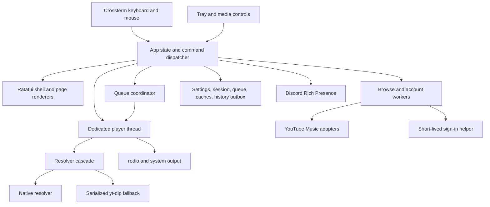

# MTUI System Design

**Status:** Active direction\
**Version:** 0.2\
**Date:** 2026-10-06\
**Related documents:** [Requirements](requirements.md) · [Analysis](analysis.md)

## 1. Design summary

MTUI remains a Rust terminal application using Ratatui and Crossterm. The main
thread owns terminal input, application state, layout, and rendering. A
dedicated player thread owns audio. Source workers handle YouTube Music,
artwork, lyrics, comments, related content, session work, and history reporting.
Browser code exists only in the short-lived sign-in helper.

The design adds features through the existing product rather than maintaining a
second GUI. State and user intent will be separated from page rendering in
small steps so keyboard, mouse, tray, and tests use the same commands.

## 2. Design principles

1. Playback remains responsive while any page loads or fails.
2. The TUI renders state and emits commands; it does not perform blocking I/O.
3. Every queue, cache, log, retry loop, and background operation is bounded.
4. Every feature has loading, ready, empty, partial, offline, and error states
   where those states apply.
5. The same layout calculation produces visible regions and mouse hit targets.
6. The interface stays minimal and uses artwork for one accent color only.
7. Narrow-terminal behavior is designed and tested, not left to clipping.
8. Existing working behavior is moved only behind tests.

## 3. Runtime architecture



| Execution unit | Responsibility | Lifetime |
|---|---|---|
| Main thread | Terminal lifecycle, input, command dispatch, state updates, rendering | Application |
| Player thread | Decoder, sink, clock, seek, volume, output device | Application |
| Source workers | Browse/search, account, artwork, lyrics, comments, related, history | Application with bounded queues |
| Resolver worker | Serialized source resolution and refresh | Application or on demand |
| yt-dlp helper | Last-resort resolution | Short lived |
| Sign-in helper | Real Google page and session capture | Sign-in/renewal only |
| Platform threads | Tray and supported Windows callbacks | Application |

## 4. Logical code structure

The current modules remain valid while behavior is extracted feature by
feature. The target shape is:

```text
src/
  main.rs                 composition and process lifecycle
  app/
    mod.rs                App and update loop
    command.rs            semantic Command enum
    navigation.rs         route stack and scroll restoration
    overlay.rs            menus, dialogs, messages, pickers
  pages/
    home.rs
    search.rs
    library.rs
    artist.rs
    album.rs
    playlist.rs
    now_playing.rs
  ui/
    mod.rs                root renderer
    shell.rs              header, content, player bar
    layout.rs             responsive regions and hit targets
    components.rs         rows, cards, tabs, progress, scrollbars, states
    pages/                 page renderers only
  playback/
    coordinator.rs        queue and recovery state machine
    model.rs              UI-facing playback snapshot
  player/                 existing audio implementation
  source/                 YouTube Music workers and typed adapters
  storage/                settings, session, queue, caches, history
  platform/               tray, Discord, media keys, sign-in
```

Dependencies point inward: page renderers may read page state and shared UI
components; source and player code never import UI types. The split happens
only as related features are changed, avoiding a high-risk rewrite.

## 5. State and commands

Input handlers translate device events into semantic commands:

```text
Navigate(Home)
NavigateBack
FocusSearch
SearchChanged(query)
Open(item)
Play(item, context)
TogglePlayback
SeekTo(ratio)
SetVolume(ratio)
PlayNext(item)
AddToQueue(item)
MoveQueueItem(from, to)
SelectPlayerTab(Queue | Lyrics | Comments | Related)
OpenAccountMenu
Retry(operation)
```

Keyboard, mouse, tray, and media controls dispatch the same commands. Commands
may start asynchronous work, but results return as typed events carrying an
operation identifier. Stale events cannot replace newer state.

Major state slices:

- navigation and active page;
- Home, Search, Library, Artist, Album, and Playlist page state;
- playback snapshot and recovery state;
- current and upcoming queue;
- Now Playing tab data;
- account/session state;
- overlays and notifications;
- persisted settings and component health.

## 6. TUI shell

The current coding increment provides a compact Home/Playing/search/Menu
header, borderless browse pages, a dedicated two-column Now Playing page, and
a three-row persistent player strip. On narrow windows, track identity moves
above the player tabs. Secondary controls remain in menus. Shared geometry is
implemented in `src/ui/shell.rs` and used by rendering and layout verification.
The broader navigation and browse-side-pane composition below remains planned.

### 6.1 Regions

```text
┌──────────────────────────────────────────────────────────────────────┐
│ ‹  ›   HOME / SEARCH                       Account   Menu            │
├───────────────────────────────────────────┬──────────────────────────┤
│                                           │ QUEUE LYRICS COMMENTS    │
│ Active page                               │ RELATED                  │
│ Home / Search / Library / detail          │                          │
│                                           │ Selected player content  │
├───────────────────────────────────────────┴──────────────────────────┤
│ ◀  ▶/Ⅱ  ▶   title — artist       01:12 ━━━━━●━━━━ 03:48   🔊 72%   │
└──────────────────────────────────────────────────────────────────────┘
```

- The header contains navigation, current location/search, account, and menu.
- The content region shows one active browse page.
- The player side pane is a dedicated surface with Queue, Lyrics, Comments,
  and Related tabs.
- The bottom player is persistent. Its progress track uses the full available
  width and supports clicking or dragging to seek.
- There is no permanent left navigation rail and no permanent user tag.

### 6.2 Responsive behavior

| Width/height | Composition |
|---|---|
| Wide | Browse content and selected player tab side by side; full transport row |
| Medium | Browse content above a shorter player pane; compact metadata |
| Narrow/short | One primary surface at a time; player bar remains; tabs open as full-page views |
| Below minimum | Clear size message with the minimum required dimensions |

Layout functions clamp every region and never rely on byte length for visible
width. Long metadata truncates by Unicode display width.

### 6.3 Visual language

- Neutral terminal background and readable foreground.
- One accent derived from the current artwork and adjusted for contrast.
- No gradients, excessive borders, fake glass, dashboard cards, or decorative
  status panels.
- Strong type hierarchy comes from weight, case, spacing, and color.
- Selection, focus, playing, disabled, loading, and error states remain
  distinguishable in monochrome terminals.
- High-resolution image protocols are optional enhancements; colored ASCII or
  a compact placeholder always works.

## 7. Page design

### 7.1 Home

Show a compact greeting only when useful, followed by horizontally navigable
shelves. Shelf headers expose See all when a complete page exists. Cards show
artwork, title, and one metadata line. Loading preserves shell stability.

### 7.2 Search

The header search field receives focus by `/`, `i`, or click. Suggestions appear
while editing. Results group songs, albums, artists, and playlists, with Songs
as rows and collections as cards where space permits. Context actions stay
consistent across result types.

### 7.3 Library

Library uses top-level filters rather than a permanent sidebar. It covers
playlists, albums, songs, artists, likes, and history as endpoints become
available. Each filter has independent selection and scroll restoration.

### 7.4 Artist, album, and playlist

Detail pages start with artwork and identity, then put playable rows first.
Primary Play, Shuffle, and Radio actions remain visible. Secondary queue and
library actions live in the context menu. Artist catalogue shelves follow top
songs.

### 7.5 Now Playing

The dedicated view prioritizes current artwork, track identity, transport, and
the progress bar. Queue, Lyrics, Comments, and Related are peer tabs; the user
never has to return to a browse page to switch among them. Manual lyric
scrolling pauses follow mode and provides one action to return to the current
line.

### 7.6 Settings and diagnostics

Implemented preferences use one grouped page: Playback (audio output),
Appearance (cover style, artwork display, tray icon), and Integrations (Discord
presence and tray visibility). Choice lists show the current value and apply
only after confirmation; keyboard and mouse use the same semantic setting.
Esc returns through choice list → Settings → originating menu. Account/session
actions remain under Menu → Account. `src/app/preferences.rs` owns this state;
`src/ui/preferences.rs`, `menu.rs`, and `dialog.rs` own its presentation.

The remaining target is:

Settings is a modal/full surface with Playback, Appearance, Account,
Integrations, Storage, and Advanced categories. Diagnostics shows component
health, resolver/runtime versions, cache use, redacted recent failures, repair
actions, and a sanitized copy action.

## 8. Mouse model

- Single click focuses or activates standard buttons, tabs, rows, and cards.
- Double click may immediately play a playable row; single click selects it.
- Wheel scrolls the region under the pointer.
- Clicking or dragging the progress bar seeks by position ratio.
- Clicking or dragging the volume bar sets volume.
- Queue items expose play, remove, and movement actions; wheel plus visible
  controls are the reliable baseline because terminal drag events vary.
- Right click or the `.` key opens the same contextual action menu.

Every frame produces a hit map from the final layout rectangles. Hidden or
clipped content never leaves an active hit target.

## 9. Playback recovery design

```text
Resolve native
  -> validate response and supported format
  -> start bounded stream
  -> on expiry/range failure refresh URL and resume
  -> try alternate supported format
  -> invoke serialized yt-dlp fallback
  -> renew session when authentication is the likely cause
  -> show categorized Retry / Skip error
```

The UI receives explicit states: resolving, buffering, playing, paused,
recovering with attempt count, unavailable, and failed. Resolver errors retain
technical causes in redacted logs while the TUI shows a concise action.

Implemented recovery details (2026-10-07): the native completion path checks
every configured client before falling back to yt-dlp. Audio-only extraction
runs before the mixed MP4 fallback, with time reserved for compatibility work.
The AAC decoder filters packets by audio track ID and uses that track's timing;
its fixed 2 MiB cache handles interleaved MP4 without downloading the whole file.
The download ring remains 1 MiB. Byte-offset handoff requires matching itag,
signed file size, and modification revision; other handoffs reopen at the
current track time. Replacement commits reset the source clock origin while
preserving the retry budget. Failed URL caches are invalidated on recovery and
manual retry. Live tests cover full decoding, playback pace, and a silent
handoff through the production audio thread.

## 10. Storage and resource budgets

- Persist settings with a schema version and atomic replacement.
- Persist queue and history outbox in crash-safe bounded records.
- Protect session material per Windows user.
- Keep only the decoded current cover plus a byte-bounded artwork LRU.
- Bound audio buffering independently of track length.
- Cap worker queues and reject or coalesce stale requests.
- Stop sign-in and resolver helper processes after their operation.

The release gate is a 40–60 MiB steady-state private working set, targeting
approximately 50 MiB, plus the soak criteria from the requirements.

## 11. Verification strategy

### 11.1 Deterministic TUI tests

Use Ratatui `TestBackend` to render real page state and verify:

- narrow, normal, and wide terminal layouts;
- long Latin text, CJK, emoji, missing metadata, and extreme durations;
- loading, empty, partial, offline, and error states;
- focus and selection movement;
- progress and volume geometry;
- player tab and overlay precedence;
- hit targets matching drawn controls;
- no drawing outside assigned regions.

### 11.2 Behavior tests

- Command/update tests for navigation, queue editing, playback state, session
  transitions, and stale-event rejection.
- Saved fixtures for YouTube response parsing.
- Player tests for URL refresh, seek/resume, prefetch, and bounded retry.
- Windows smoke tests for mouse, tray, media keys, sign-in, install, and resume.
- Compatibility-set and eight-hour memory/CPU soak before release.

## 12. Delivery phases

### Player refinement decisions — 2026-10-08

Derive a muted background and raised surfaces from the playing cover, with a brighter accent for controls and readable neutral text. Apply the palette across the app without recoloring artwork pixels or introducing gradients. The playback strip belongs to this same palette rather than a separate black slab.

Keep artist and album text as navigation targets. Each target must preserve YouTube Music's canonical browse ID and optional parameters; a display name is insufficient to invent an album or artist route.

Provide Like, Share, Save to playlist, Shuffle, Repeat, and Output device in the persistent playback bar. Wider windows show individual actions; narrow windows keep these available through a clearly labeled player-actions menu. Like and Save require authenticated server writes and visible success/failure states. Output opens the existing device chooser. Repeat indicates Off, All, or One; shuffle preserves the currently playing track.

The TUI now uses a persistent action row with Like, Share, Save to playlist, Shuffle, Repeat, and Output. Actions / Ctrl+P opens the complete menu at every normal window width. Share presents the canonical Music link and copies it through the Windows clipboard. The save picker pins the song it was opened for, lists editable playlists (bounded to 100), marks existing membership, and has loading, saving, empty, error, and refresh states.

Account actions use a dedicated bounded worker, separate from browsing and audio resolution. Each action captures the account session when queued and checks it before every request; logout or refresh invalidates earlier actions. Likes are confirmed by a fresh rating read. Liked Music saves use the Like operation. Regular playlist saves preserve duplicate checking and accept an explicit successful acknowledgement for the single requested song; ambiguous responses are checked against the playlist's track shelf and bounded continuations. Missing menu membership flags remain unknown. Neither operation retries a write automatically after a timeout. Request IDs prevent late responses from changing another song or picker.

Saved browser sessions renew automatically after 48 hours while MTUI runs, including in the tray. A lightweight policy check runs once a minute; no browser stays resident between renewals. Explicit authentication failures from current account requests, personalized browsing, or listening reports can bring renewal forward, while permission errors, rate limits and media 403s do not. Attempts are persisted before helper startup and back off from one hour to a day after failures, including across restarts. Automatic helpers stay hidden, check the Music page's logged-in bootstrap state before capturing cookies, and have a 45-second verification deadline plus a 60-second parent-process deadline. Success updates credentials without reloading the current page or touching audio. Logout and newer sign-in generations reject late helper results; logout remains available during renewal. A confirmed guest bootstrap or Google sign-in challenge opens the existing interactive recovery flow automatically, once per failed session. Temporary network failures remain quiet. Successful attempts also retain a cooldown to prevent a faulty endpoint from repeatedly opening a browser. This controls MTUI's renewal frequency, not Google's session expiry, and does not yet unify account/channel context across every endpoint.

Browsing and current-cover reads coalesce to the newest request and cancel obsolete HTTP work. Player panels coalesce by operation, while radio continuations remain available to their queue. Artwork requests follow the visible page, prioritize new tiles, and run in batches of at most four; returning to a page requeues unfinished images while retaining loaded covers. HTTP response limits apply during decompression and download. JPEG dimensions and decoding buffers are checked before pixel expansion. Configuration files are replaced atomically, and volume persistence waits 250 ms after the last change and flushes on exit.

Queue rows keep two cells between metadata columns and one blank row between songs when the panel can show at least four songs. Short panels retain compact rows. Drawing, scrolling, and mouse targets share the same item geometry; blank spacer rows have no playback action. Wide windows grant the side panel up to 68 cells with two cells of inner padding. Track identity keeps extra space around its status and title when height allows, and playback actions keep clear gaps between labels.

Lyrics use quieter preceding lines, bright current text, comfortable paragraph spacing, and automatic following that yields to manual scrolling. Transparency is an optional host capability rather than a substitute for contrast.

1. **Clean baseline:** remove GUI residue, keep the root TUI as the only product,
   and run its complete tests.
2. **Shell and Now Playing:** align regions, implement the full-width seek bar,
   dedicated player tabs, responsive layouts, and mouse parity.
3. **Playback reliability:** categorize failures, improve fallback, and add the
   compatibility set.
4. **Account and library:** session repair, protected storage, Library, likes,
   and remote history.
5. **Browse completeness:** finish search taxonomy, continuations, page actions,
   and all state surfaces.
6. **Windows polish:** media controls, diagnostics, installer flow, and resource
   soak.
